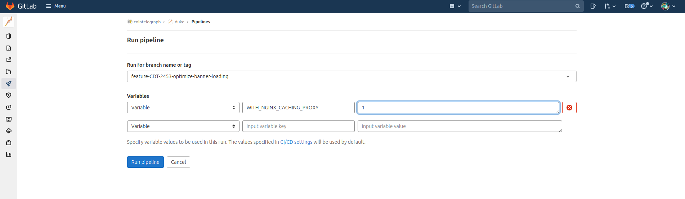

# edge caching simulation

this directory contains config files for special Dockerfile stage,
made for debugging how site behaves when cached on Cloudflare

to enable on CI put "WITH_NGINX_CACHING_PROXY" env var with value "1" on "build" job only on "qa" pipeline

like this:



or build it locally:

```shell
cd ../.. # go to repository root
docker build -t duke-nginx --build-arg WITH_NGINX_CACHING_PROXY=1 .
docker run -it --rm -p 3000:3000 duke-nginx
# yeah nginx gonna be exposed on 3000 when caching proxy enabled
```

Each response should include `X-Duke-Nginx-Cache-Zone` header with this values:
- _ssr_ for Cached SSR generated HTML's
- _static_ for static assets like JS, CSS, images, etc
- _off_ when caching disabled at all
