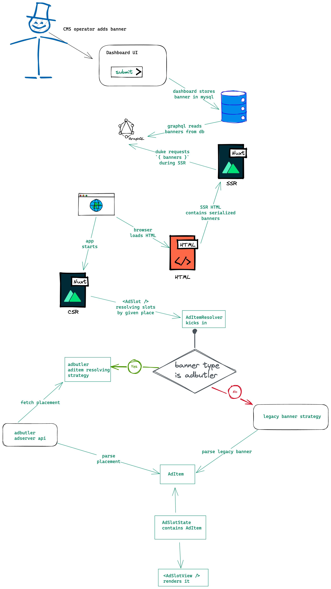

# Ads

Advertisement on the site

## Getting started

`<AdSlot />` component and `useAdSlot()` composable used for defining insertion point of advertisement

Check out `AdView.story`

_Advertisement publishing and presentation flow:_


## Usage

```vue
<template>
  <!-- insert leaderboard -->
  <AdSlot
    place="leaderboard"
    :config="{
      aspectRatio: 130 / 2320,
    }"
  />

  <!-- promo button stack -->
  <AdSlot
    place="promo_button_stack_mobile_index"
    :config="{
      adblockFallbackDisabled: true,
      promoButtonDisclaimerHidden: true,
    }"
  />

  <!-- place "index", third banner -->
  <AdSlot
    place="index"
    index="2"
  />

  <!-- slots -->
  <AdSlot place="in_mobile_header">
    <span>Ad</span>
  </AdSlot>
</template>

<script setup lang="ts">
import { useAdSlot } from '~/features/ads';

const customSlot = useAdSlot('some-custom-place', 0);
</script>
```

**IMPORTANT NOTES**

1. Always define "aspectRatio" for pure image places (leaderboard, index page, sidebar, etc) to prevent CLS
2. Set "adblockFallbackDisabled" for places that do not require to show fallback
3. Define wrappings component for same places across app

## Quirks

### Sidebar widgets is banners too

Yeah, in Dashboard they stored as banners with type of "widget"

TBD: separate sidebar widgets and banner system

### Banner fetching and rotation

Currently, all banners fetched and shuffled during SSR

TBD: move to GraphQL

## TODO:

- [ ] keywords
- [ ] auto-refresh
- [ ] drop sidebar widgets
- [ ] add Promo buttons
- [ ] add Stretch banners
- [ ] add Story widget
